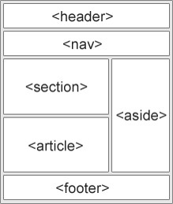

# Apuntes de la clase 4 HTML
## Incluyendo CSS en mi documento HTML
### CSS Externo
Para agregar CSS externo, este se escribe en un fichero con la extension `.css` y se incluye en el HTML con la etiqueta ```<link>```. Es necesario incluir la ruta de donde se encuentra su archivo con el atributo `href`.
* Ejemplo
```
    <link rel="stylesheet" href="css/style.css">
```
### CSS interno
Para incluir CSS interno en nuestro documento HTML, debemos agregar el código entre etiquetas ```<style>``` en el `head` de nuestro documento.
* Ejemplo
```
    <head>
        <style>
            h1{
                color:red;
            }
        </style>
    </head>
```
### CSS en línea
Para incluir estilos CSS en línea, debemos utilizar el atributo ```style``` directamente en cada etiqueta. Tenga en cuenta que los cambios dictados por este código tendrán mas prioridad que el interno y externo.
* Ejemplo
```
    <p style="color:blue;">Si algo funciona, no lo toques</p>
```
### Semántica HTML
Cuando hablamos de semántica HTML no hablamos de diseño, sino, la manera de escribir un documento web que se adapte a los estándares y que de esta manera los navegadores puedan interpretar de forma correcta la información.

* Ejemplo
```
    <html>
        <head>
            <title>Mi sitio semantico</title>
        </head>
        <body>
            <header>
            </header>
            <nav>
            </nav>
            <main>
                <section>
                </section>
                <article>
                </article>
                <aside>
                </aside>
            </main>
            <footer>
            </foter>
        </body>
    </html>
```